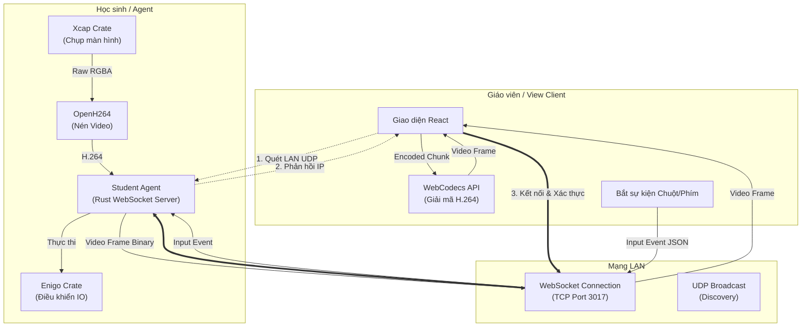
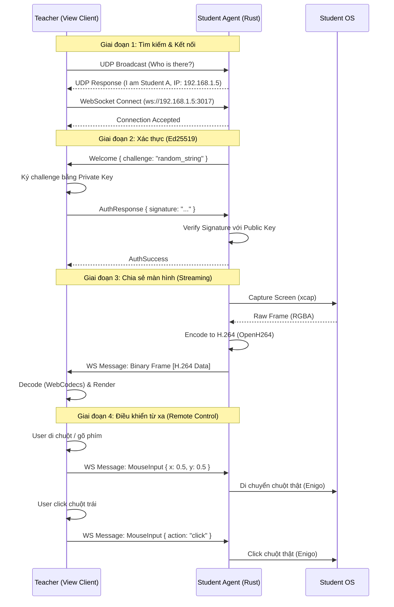

# Luồng hoạt động: Xem và Điều khiển Màn hình (Smartlab)

Tài liệu này mô tả chi tiết luồng dữ liệu và tương tác giữa Giáo viên (Teacher) và Học sinh (Student Agent).

## 1. Tổng quan Kiến trúc

## 2. Biểu đồ Tuần tự (Sequence Diagram)

