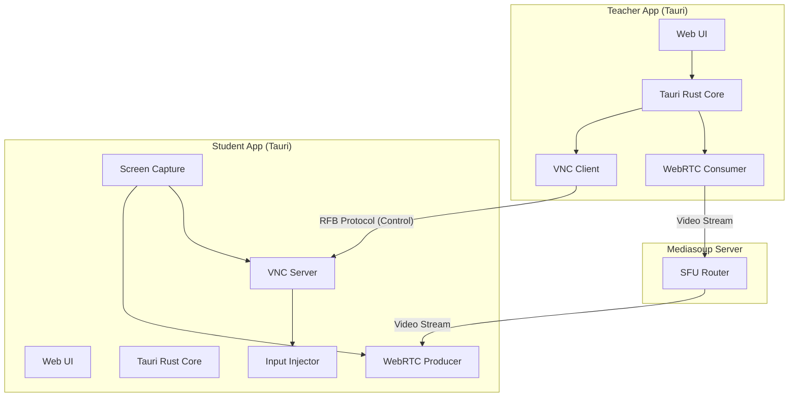
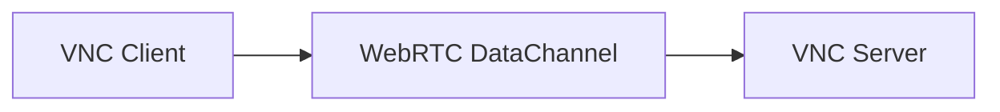

# Kế hoạch tích hợp VNC vào dự án Tauri + WebRTC/Mediasoup

## Kiến trúc tổng quan



## Phân tích các thành phần

### 1. VNC Server (Student side) - Nhận lệnh điều khiển

**Lựa chọn thư viện cho Rust/Tauri:**

| Thư viện | Platform | Ưu điểm | Nhược điểm |

|----------|----------|---------|------------|

| `libvncserver` (FFI) | All | Mature, full-featured | C library, cần bindings |

| `vnc-rs` (Rust native) | All | Pure Rust, dễ tích hợp | Chưa mature |

| Custom RFB impl | All | Full control | Tốn thời gian |

**Khuyến nghị**: Sử dụng `libvncserver` qua FFI bindings hoặc implement RFB protocol subset trong Rust.

### 2. Input Injection (Student side) - Thực thi keyboard/mouse

**macOS:**

- `CGEventPost` / `CGEventCreateKeyboardEvent` (Core Graphics)
- Yêu cầu: Accessibility permissions

**Windows:**

- `SendInput` API (user32.dll)
- Hoặc sử dụng `Interception` driver (như Veyon)

**Rust crates:**

- `enigo` - Cross-platform input simulation
- `rdev` - Device events (keyboard/mouse)

### 3. Screen Capture (Student side)

Đã có qua WebRTC, nhưng VNC cũng cần frame buffer cho một số operations:

**macOS:**

- `CGDisplayStream` / `SCScreenRecorder` (ScreenCaptureKit - macOS 12.3+)

**Windows:**

- Desktop Duplication API (DXGI)
- Hoặc sử dụng `ddengine.dll` từ UltraVNC

### 4. VNC Client (Teacher side) - Gửi lệnh điều khiển

**Rust crates:**

- `vnc` crate - VNC client implementation
- Hoặc custom RFB client (chỉ cần gửi input events)

### 5. Tích hợp với WebRTC/Mediasoup hiện tại

```
┌─────────────────────────────────────────────────────────┐
│                    Data Flow                             │
├─────────────────────────────────────────────────────────┤
│                                                          │
│  [Video Stream]                                          │
│  Student Screen → WebRTC Producer → Mediasoup → Teacher  │
│                                                          │
│  [Control Commands]                                      │
│  Teacher Input → VNC Client → VNC Server → Student Input │
│                                                          │
│  [Signaling]                                             │
│  Both → WebSocket → Mediasoup Signaling Server           │
│                                                          │
└─────────────────────────────────────────────────────────┘
```

## Cấu trúc project đề xuất

```
your-project/
├── src-tauri/
│   ├── src/
│   │   ├── main.rs
│   │   ├── vnc/
│   │   │   ├── mod.rs
│   │   │   ├── server.rs      # VNC server (student)
│   │   │   ├── client.rs      # VNC client (teacher)
│   │   │   └── rfb.rs         # RFB protocol types
│   │   ├── input/
│   │   │   ├── mod.rs
│   │   │   ├── macos.rs       # macOS input injection
│   │   │   └── windows.rs     # Windows input injection
│   │   ├── capture/
│   │   │   ├── mod.rs
│   │   │   ├── macos.rs       # macOS screen capture
│   │   │   └── windows.rs     # Windows screen capture
│   │   └── control/
│   │       ├── mod.rs
│   │       ├── lock_screen.rs
│   │       ├── power.rs       # Shutdown/reboot
│   │       └── clipboard.rs
│   └── Cargo.toml
├── src/                        # Web frontend
└── mediasoup-server/           # Existing Mediasoup server
```

## Dependencies cần thêm (Cargo.toml)

```toml
[dependencies]
# Input simulation
enigo = "0.2"

# Screen capture (optional, nếu không dùng WebRTC cho capture)
scrap = "0.5"

# Async runtime
tokio = { version = "1", features = ["full"] }

# Network
tokio-tungstenite = "0.21"  # WebSocket for VNC over WS

# Platform-specific
[target.'cfg(target_os = "macos")'.dependencies]
core-graphics = "0.23"
core-foundation = "0.9"

[target.'cfg(target_os = "windows")'.dependencies]
windows = { version = "0.52", features = [
    "Win32_UI_Input_KeyboardAndMouse",
    "Win32_Graphics_Gdi",
    "Win32_System_Power"
]}
```

## Phương án thay thế: VNC over WebRTC DataChannel

Thay vì kết nối VNC trực tiếp, có thể tunnel VNC qua WebRTC DataChannel:



**Ưu điểm:**

- Sử dụng lại infrastructure WebRTC hiện có
- NAT traversal tự động (ICE/STUN/TURN)
- Encryption built-in (DTLS)

**Nhược điểm:**

- Thêm layer phức tạp
- Latency có thể cao hơn

## Các vấn đề cần lưu ý

### Permissions

**macOS:**

- Screen Recording permission (Privacy settings)
- Accessibility permission (cho input injection)
- Cần hướng dẫn user enable trong System Preferences

**Windows:**

- UAC elevation cho một số operations
- Có thể cần chạy as Administrator

### Security

- Mã hóa connection (TLS/DTLS)
- Authentication giữa teacher và student
- Rate limiting để tránh abuse

## Các bước triển khai

1. Setup VNC server module trong Tauri (student side)
2. Implement input injection cho macOS và Windows
3. Setup VNC client module (teacher side)
4. Tích hợp với WebRTC signaling hiện có
5. Implement các tính năng control (lock, power, clipboard)
6. Testing cross-platform
7. Handle permissions và security